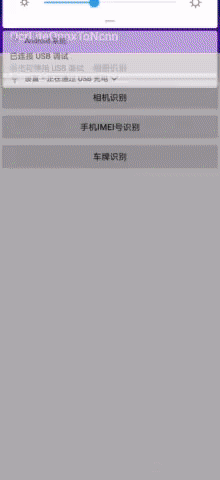

# OcrLiteAndroidNcnn

[](https://github.com/benjaminwan/OcrLiteAndroidNcnn/issues)
[](https://github.com/benjaminwan/OcrLiteAndroidNcnn)

<details open>
    <summary>目录</summary>

- [OcrLiteAndroidNcnn](#OcrLiteAndroidNcnn)
    - [联系方式](#联系方式)
    - [项目完整源码](#项目完整源码)
    - [APK下载](#APK下载)
    - [简介](#简介)
    - [总体说明](#总体说明)
    - [更新说明](#更新说明)
    - [编译说明](#编译说明)
        - [编译Release包](#编译Release包)
        - [AndroidStudio调试启动](#AndroidStudio调试启动)
        - [重新编译](#重新编译)
    - [项目结构](#项目结构)
    - [常见问题](#常见问题)
        - [输入参数说明](#输入参数说明)
    - [关于作者](#关于作者)
    - [版权声明](#版权声明)
    - [示例图](#示例图)
        - [IMEI识别](#IMEI识别)
        - [身份证识别](#身份证识别)
        - [车牌识别](#车牌识别)

</details>

## 联系方式

* QQ①群：994929053(满)
* QQ②群：820132154(满)
* QQ③群：904091319(满)
* QQ④群：615877948(满)
* QQ⑤群：185905924(满)
* QQ⑥群：628010752

## 项目完整源码

* 整合好源码和依赖库的完整工程项目，可到Q群共享内下载或Release下载，以Project开头的压缩包文件为源码工程，例：Project_OcrLiteAndroidNcnn-版本号.7z
* 如果想自己折腾，则请继续阅读本说明

## APK下载

* 编译好的demo apk，可以在release中下载，或者Q群共享内下载，文件名例：OcrLiteAndroidNcnn-版本号-cpu-release.apk
* 或者[Github下载](https://github.com/benjaminwan/OcrLiteAndroidNcnn/releases)

## 简介

Chineseocr Lite Android Ncnn Demo，超轻量级中文OCR Android Demo，支持ncnn推理 (DBNet+AngleNet+CRNN)
把onnx模型格式转为ncnn格式，并使用ncnn推理框架进行OCR识别。
**代码和模型均源自chineseocr lite的onnx分支**

详情请查看 [https://github.com/ouyanghuiyu/chineseocr_lite](https://github.com/ouyanghuiyu/chineseocr_lite)

采用ncnn神经网络前向计算框架[https://github.com/Tencent/ncnn](https://github.com/Tencent/ncnn)

## 总体说明

1. 封装为独立的Library，可以编译为aar，作为模块来调用；
2. Native层以C++编写；
3. Demo App以Kotlin-JVM编写；
4. Android版与其它版本不同，包含了几个应用场景，包括相册识别、摄像头识别、手机IMEI号识别、摄像头身份证识别这几个功能页面；
5. 可选择CPU版或GPU版；CPU版仅支持CPU运算，最低支持API21，且安装包体积小；GPU版支持vulkan(GPU加速)，最低支持API24，安装包体积较大；

## 更新说明

#### 2021-09-28 update 1.6.0

* opencv 3.4.15(特别说明：4.5.3也可以支持，如果换成cv4，minSdkVersion必须改为24)
* ncnn 20210720
* 升级kotlin: 1.5.31
* 升级gradle: 7.0.2
* 升级各dependencies
* 使用kotlin coroutines代替rxjava

#### 2021-10-28 update 1.6.1

* 编辑build.gradle，把版本定义放到root build.gradle
* 编辑github workflow config，上传aar文件到release

#### 2022-03-03 update 1.6.2

* 升级gradle
* 升级依赖库

#### 2022-06-20 update 1.7.0

* ncnn 20220420，更新后模型支持有变化，需要重新用ncnn自带的onnx2ncnn转换模型
* 高版本的opencv会要求 Minimum required by OpenCV API level is android-24，所以目前仍停留在3.4.15
* 如果不在意MinSdk，可自行[下载新版opencv](https://github.com/nihui/opencv-mobile/releases)

#### 2022-02-16 update 1.8.0

* 增加相册识别和相机识别停止按钮
* 添加 Java demo
* 适配ncnn 20221128

### [编译说明](./BUILD.md)

### [使用说明](./INSTRUCTIONS.md)

## 项目结构

```
OcrLiteAndroidNcnn
    ├── app               # demo app
    ├── capture           # 截图
    ├── common-aar        # app引用的aar库
    ├── keystore          # app签名密钥文件
    ├── OcrLibrary        # Ocr引擎库，包含Jni和C++代码
    └── scripts           # 编译脚本
```

## 常见问题

### 输入参数说明

请参考[OcrLiteOnnx项目](https://github.com/ouyanghuiyu/chineseocr_lite/tree/onnx/cpp_projects/OcrLiteOnnx)

## 关于作者

* Android demo编写：[benjaminwan](https://github.com/benjaminwan)
* 模型开发：[DayBreak](https://github.com/DayBreak-u)

## 版权声明

- OCR模型版权归[DayBreak](https://github.com/DayBreak-u)所有；
- 其它工程代码版权归本仓库所有者所有；

## 示例图

#### IMEI识别


#### 身份证识别


#### 车牌识别



